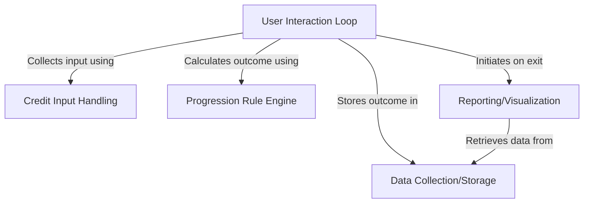
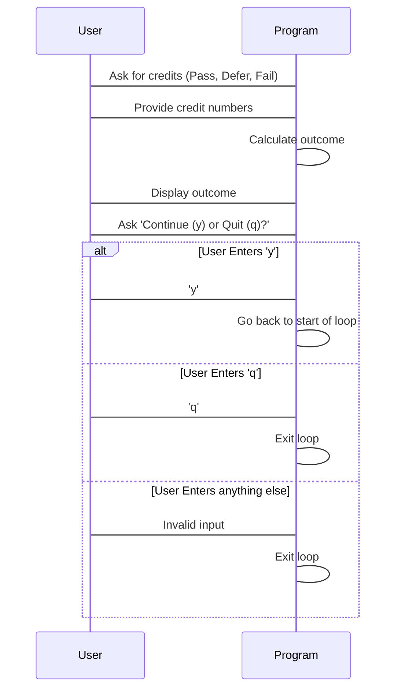
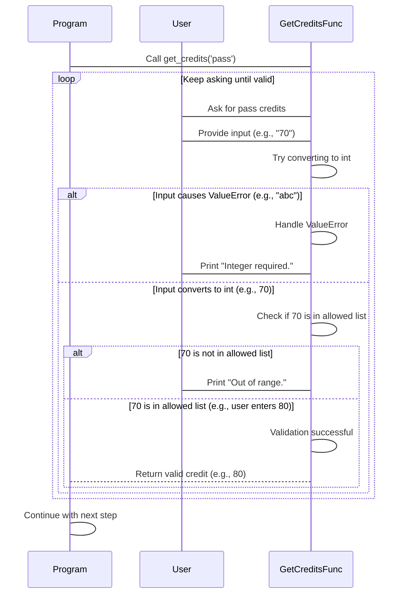
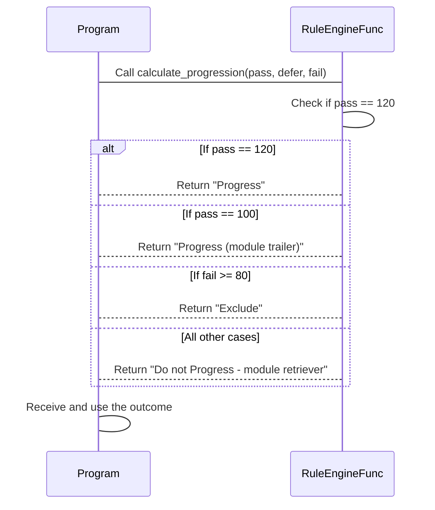
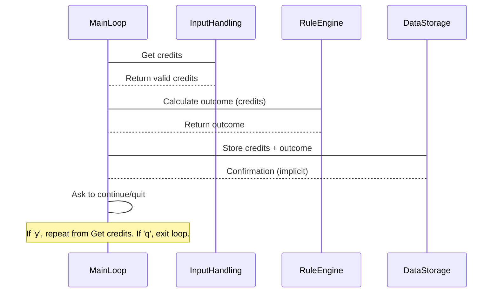
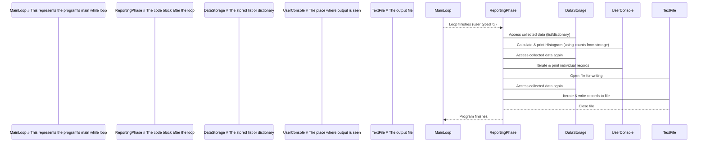

# Tutorial: Student-Progression-Outcome-Predictor

This program helps predict a student's **academic outcome** based on their **credit points** in Pass, Defer, and Fail categories.
It takes the credit numbers, applies specific *rules* to determine if they **Progress**, are a *Trailer*, *Retriever*, or *Excluded*.
The results for *multiple students* can be entered, and the program will save them and provide a *summary report* (including a simple histogram) at the end.


## Visual Overview



## Chapters

1. [User Interaction Loop
](01_user_interaction_loop_.md)
2. [Credit Input Handling
](02_credit_input_handling_.md)
3. [Progression Rule Engine
](03_progression_rule_engine_.md)
4. [Data Collection/Storage
](04_data_collection_storage_.md)
5. [Reporting/Visualization
](05_reporting_visualization_.md)

---

<sub><sup>Generated by [AI Codebase Knowledge Builder](https://github.com/The-Pocket/Tutorial-Codebase-Knowledge).</sup></sub>

# Chapter 1: User Interaction Loop

Welcome to the tutorial for the Student Progression Outcome Predictor project! In this first chapter, we're going to look at the foundational structure that makes our program interactive and capable of processing more than just one student at a time. This structure is called the "User Interaction Loop".

### What Problem Does the Loop Solve?

Imagine you have the program ready to calculate the outcome for *one* student based on their credits. That's great! But what if you have a whole list of students to process? Running the program, entering details for one student, having it finish, and then having to run it *again* for the next student would be very tedious.

We need a way for the program to:
1.  Do its job for one student.
2.  Immediately ask if we have another student to process.
3.  If yes, go back to step 1.
4.  If no (or if we want to stop), finish up and exit.

This is exactly what the "User Interaction Loop" helps us achieve. It keeps the program running in circles, processing one student after another, until you tell it to stop. Think of it like a conveyor belt in a factory: it brings one item (a student's data) to the processing station, waits for it to be processed, and then brings the *next* item, and keeps doing this until the 'shift' is over.

### The Core Idea: Doing Things Repeatedly

The fundamental concept behind the user interaction loop is repetition. We want to repeat a set of actions:
*   Get student credit information.
*   Calculate their outcome.
*   Show the outcome.
*   Ask if we should do it again.

In programming, repetition is often handled using **loops**. Our user interaction loop uses a `while True` loop in Python.

### How the Loop Works Step-by-Step

Let's break down the main steps that happen inside this loop for each student:

1.  **Ask for Input:** The program needs the student's credits for Pass, Defer, and Fail. It prompts the user to enter these values.
2.  **Validate Input:** It checks if the entered credits are valid (e.g., numbers within a specific range, total adding up to 120). If not valid, it might ask again or signal an error.
3.  **Calculate Outcome:** Using the valid credits, the program applies the rules to determine the student's progression outcome (like 'Progress', 'Trailer', 'Retriever', 'Exclude').
4.  **Display Outcome:** The calculated outcome is shown to the user.
5.  **Ask to Continue:** The program asks the user if they want to enter data for another student or if they are done.
6.  **Decide Next Action:**
    *   If the user says "yes" (usually by typing 'y'), the loop starts over from step 1 for the next student.
    *   If the user says "quit" (usually by typing 'q'), the loop stops, and the program moves on to any steps that come *after* the loop (like showing the final report).
    *   If the user enters something else, the program might consider it an invalid choice and stop the loop.

This cycle repeats as long as the user indicates they want to continue.

### Looking at the Code

Let's find this loop structure in the code. In `Part 1 - Main Version.py`, you'll see a section that looks like this:

```python
# Loop for multiple outcomes
while True:
    # Code to get credits, calculate outcome, display, etc.
    # ...

#C. MULTIPLE OUTCOMES
    choice = input("Do you want to enter grades for another student?\nEnter 'y' for yes or 'q' to quit and view result: : ")
    if choice == "q":
        print("\nExiting program...\n")
        break # This stops the while loop
    elif choice == "y":
        continue # This jumps back to the start of the while loop
    else:
     print("\nInvalid choice. Exiting program with output....\n")
     break # Also stops the loop
```

Let's break down this small code snippet:

```python
while True:
    # ... (the actions to process one student are here)
```
`while True:` means "keep doing what's inside this loop forever, unless something specifically tells you to stop".

```python
    choice = input("Do you want to enter grades for another student?\nEnter 'y' for yes or 'q' to quit and view result: : ")
```
After processing one student, this line asks the user what they want to do next. The user's answer is stored in the `choice` variable.

```python
    if choice == "q":
        print("\nExiting program...\n")
        break
```
This is the stop condition. If the user typed 'q', the message "Exiting program..." is printed, and the `break` command *immediately* stops the `while True` loop. The program then continues with whatever code comes *after* the loop.

```python
    elif choice == "y":
        continue
```
If the user typed 'y', the `continue` command tells the loop to *immediately* jump back to the very beginning of the `while True` loop and start over with the next student.

```python
    else:
     print("\nInvalid choice. Exiting program with output....\n")
     break
```
If the user typed anything other than 'y' or 'q', the program considers it an invalid choice, prints a message, and uses `break` to stop the loop.

This `while True` loop, combined with the `input` prompt and the `if`/`elif`/`else` checks using `break` and `continue`, forms the heart of our user interaction loop.

### How it Flows (Simple Diagram)

Here's a very simple diagram showing the basic back-and-forth:



This diagram shows the basic steps the program and user take together within the loop. Notice how after the user enters 'y', the flow goes back to the beginning, ready for the next student. If they enter 'q' or anything else, the flow exits the loop sequence.

### What's Inside the Loop?

While this chapter focuses on the loop structure itself, it's important to know that inside the loop are the steps for processing a single student. We briefly saw mentions of `get_credits` and `calculate_progression`. We'll dive into how these specific actions work in future chapters:

*   Getting the credit inputs from the user (including validation) will be covered in the next chapter: [Credit Input Handling](02_credit_input_handling_.md).
*   The logic for determining the progression outcome based on the credits will be explained in: [Progression Rule Engine](03_progression_rule_engine_.md).

For now, just understand that the interaction loop is the container that repeatedly runs these individual student processing steps.

### Analogy Recap

Think of the loop as a friendly cashier at a grocery store checkout. They process one customer's items (get inputs, calculate total, tell the total - like calculating/displaying outcome), then they ask "Next customer?" (ask to continue). If you say "yes" (like typing 'y'), they are ready for the next person in line (`continue`). If there's no one else or you say "no" (like typing 'q'), they close their register (`break`).

### Conclusion

The User Interaction Loop is a crucial part of our program. It uses a `while True` loop along with `input`, `break`, and `continue` to allow the program to process data for multiple students one after another without needing to be restarted every time. This makes the program much more practical and user-friendly for handling batches of student data.

Now that we understand the overall flow and how the program repeats, the next chapter will focus on the first step *inside* the loop: getting the student's credit information from the user.

Let's move on to [Credit Input Handling](02_credit_input_handling_.md).

---

<sub><sup>Generated by [AI Codebase Knowledge Builder](https://github.com/The-Pocket/Tutorial-Codebase-Knowledge).</sup></sub> <sub><sup>**References**: [[1]](https://github.com/Sehandu-Siriwardhana/Student-Progression-Outcome-Predictor/blob/a328701f362b893d86960eebd44f69f888a382b4/Part 1 - Main Version.py), [[2]](https://github.com/Sehandu-Siriwardhana/Student-Progression-Outcome-Predictor/blob/a328701f362b893d86960eebd44f69f888a382b4/Part 4 - Dictionary.py)</sup></sub>

# Chapter 2: Credit Input Handling

Welcome back! In the last chapter, [User Interaction Loop](01_user_interaction_loop_.md), we saw how a `while True` loop keeps our program running to process data for multiple students. We learned that *inside* this loop are the steps for handling a single student, including getting their credit information.

In this chapter, we'll zoom in on that crucial first step inside the loop: getting the student's credits for Pass, Defer, and Fail. This might sound simple, but getting valid numbers from a human user always requires careful handling!

### What Problem Does Credit Input Handling Solve?

Imagine you need to ask the user how many credits a student has passed. You need a number. But what if the user types:
*   `"hello"` (text, not a number)
*   `"fifty"` (text representation of a number)
*   `"60.5"` (a number, but not a whole number)
*   `"150"` (a whole number, but too high for a single credit type)
*   `"30"` (a whole number, but not one of the allowed credit amounts like 0, 20, 40...)

If the program just tries to use these as numbers, it will either crash or produce incorrect results. We need a way to:
1.  Ask the user for the number of credits for each category (Pass, Defer, Fail).
2.  Make sure what they type can be turned into a whole number (an integer).
3.  Check if that integer is one of the specific allowed values (0, 20, 40, 60, 80, 100, 120).
4.  If *anything* is wrong, tell the user clearly what the problem is and ask them to try again *until* they enter a valid value.

This is the job of the "Credit Input Handling" part of the code. It's like having a very specific vending machine that only accepts coins of certain values (0p, 20p, 40p, etc.) and rejects anything else, telling you "Invalid coin!" until you insert a valid one.

### The Core Idea: Getting Valid Input, No Matter What

The key concept here is **validation**. We don't just *ask* for input; we *validate* it repeatedly until it's correct.

Our program uses a dedicated function for this, often called `get_credits`. This function takes care of the asking and checking process for *one* type of credit (like Pass, Defer, or Fail).

### How Input Handling Works Step-by-Step

Let's look at the steps involved when the program asks for *one* credit value (e.g., Pass credits):

1.  **Ask:** The program prompts the user to enter the credits for a specific category (e.g., "Please enter your credits at pass:").
2.  **Get Input:** The user types something and presses Enter.
3.  **Try to Convert:** The program tries to convert what the user typed into a whole number (an integer).
4.  **Check for Conversion Error:**
    *   *If it fails* (e.g., user typed "hello"), the program catches this error, prints a message like "Integer required.", and goes back to step 1.
    *   *If it succeeds* (e.g., user typed "80"), the program now has the number.
5.  **Check for Value Range/Validity:** The program checks if the number is one of the allowed values (0, 20, 40, 60, 80, 100, 120).
6.  **Check for Value Error:**
    *   *If it's not one of the allowed values* (e.g., user typed 70), the program prints a message like "Out of range.", and goes back to step 1.
    *   *If it *is* one of the allowed values* (e.g., user typed 80), the input is valid!
7.  **Return Valid Value:** The function finishes and gives the valid number back to the main part of the program so it can be used.

This sequence repeats steps 1-6 inside a loop *until* a valid number is finally returned in step 7.

### Looking at the Code: The `get_credits` Function

Let's find the code responsible for this. In both `Part 1 - Main Version.py` and `Part 4 - Dictionary.py`, you'll find a function defined like this:

```python
def get_credits(credit_type):
    # ... code to ask, check, and loop ...
```

This `get_credits` function is called three times for each student within the main interaction loop: once for "pass" credits, once for "defer", and once for "fail".

```python
    pass_credits = get_credits("pass")
    defer_credits = get_credits("defer")
    fail_credits = get_credits("fail")
```

When you see these lines in the main loop, the program pauses there and runs the code *inside* the `get_credits` function until that function successfully gets a valid number and gives it back using a `return` statement.

### Inside the `get_credits` Function: The Validation Loop

Now let's look at the code *inside* the `get_credits` function itself. It uses its *own* `while True` loop! This inner loop's job is *just* to keep asking for input for a *single* credit type until that input is valid.

Here's a simplified look at the core structure:

```python
def get_credits(credit_type):
    while True: # Keep looping until a valid input is returned
        try: # Try doing something that might cause an error
            # Get input and try to convert it to an integer
            credits = int(input(f"Please enter your credits at {credit_type}: "))

            # Check if the integer is one of the allowed values
            if credits not in [0, 20, 40, 60, 80, 100, 120]:
                print("Out of range.\n")
                # Loop continues here because we didn't return or break
            else:
                # If it's a valid integer AND in range, we can return it!
                return credits

        except ValueError: # If the try block failed (e.g., input wasn't a number)
            print("Integer required.\n")
            # Loop continues here because we didn't return or break

```

Let's break down the key parts of this internal validation loop:

```python
def get_credits(credit_type):
    while True: # Start an infinite loop for validation
        # ... rest of the code inside ...
```
The `while True:` here means "keep running the code inside this function over and over again, until you hit a `return` statement". This ensures the function won't finish until it gets a valid input.

```python
        try:
            credits = int(input(f"Please enter your credits at {credit_type}: "))
            # ... rest of try block ...
        except ValueError:
            print("Integer required.\n")
            # The loop will continue automatically after printing
```
The `try...except ValueError` block is a standard Python way to handle potential errors. The code inside `try` is executed. If at any point a `ValueError` occurs (which happens when `int()` can't convert the input string into a whole number, like if the user types "abc" or "60.5"), the code inside the `except ValueError:` block runs instead. This prints the error message and then the `while True` loop just goes back to the start, asking again.

```python
            if credits not in [0, 20, 40, 60, 80, 100, 120]:
                print("Out of range.\n")
                # The loop will continue automatically after printing
            else:
                return credits # Input is valid and in range - return it!
```
This part runs *only* if the `int()` conversion in the `try` block was successful. It checks if the converted `credits` number is *not* in the specific list `[0, 20, 40, 60, 80, 100, 120]`. If it's not, it prints "Out of range." and the `while True` loop repeats. If the number *is* in the list (the `else` part), the `return credits` statement is executed. The `return` statement immediately stops the `get_credits` function and sends the valid number back to where the function was called in the main program loop.

### How it Flows (Simple Diagram)

Here's a simplified diagram showing the interaction within the `get_credits` function for one type of credit (e.g., Pass credits), highlighting the validation loop:


This diagram shows how the `GetCreditsFunc` keeps looping and interacting with the User, using the `alt` (alternative) blocks to show different paths depending on whether the input causes an error or is out of the allowed range. It only exits the loop (`-->Program`) when a valid number is received.

### Total Credits Check

Once the program has successfully obtained valid integer inputs for Pass, Defer, and Fail credits *individually* using the `get_credits` function, there's one more check in the main loop: ensuring the *sum* of the three credits is exactly 120.

```python
    pass_credits = get_credits("pass")
    defer_credits = get_credits("defer")
    fail_credits = get_credits("fail")
    if pass_credits + defer_credits + fail_credits != 120:
        print("Total incorrect.\n")
        continue # Go back to the start of the main while True loop
    # ... if total is 120, program continues to calculate outcome ...
```
This `if` statement checks the total. If it's not 120, it prints "Total incorrect." and uses the `continue` keyword. Remember from [Chapter 1: User Interaction Loop](01_user_interaction_loop_.md), `continue` in the main loop sends the program back to the very beginning of that loop, effectively asking for all three credits again for the *same* student. This is different from the `continue` that implicitly happens within the `get_credits` function's loop, which just asks for that *single* credit type again.

### Analogy Recap

Think of `get_credits` as a very strict gatekeeper for one specific type of data (e.g., Pass credits). You keep showing the gatekeeper different forms of ID.
*   If the ID isn't even a piece of paper with writing (`ValueError`), they say "Invalid format!" and make you try again.
*   If the ID is a piece of paper, but the number on it isn't one of the specific valid numbers they accept (`Out of range`), they say "Number not recognised!" and make you try again.
*   Only when you present a piece of ID with one of the *exact* numbers they are looking for do they say "Valid!" and let you through (the function `return`s the value).

And the total check (Pass + Defer + Fail == 120) is like a final security check after you've shown all three IDs. They add up the numbers. If they don't sum to the expected total, you're sent all the way back to the start to show all three IDs again!

### Conclusion

Getting reliable input from a user is crucial. The `get_credits` function, using its own internal `while True` loop, `try...except` block, and `if...not in` check, ensures that the program only receives valid integer credit values (0, 20, 40, ..., 120) before proceeding. After getting individual valid credits, the program also performs a final check in the main loop to make sure their sum equals 120. This robust input handling prevents errors and makes the program reliable.

Now that we know how to get the valid credit numbers, the next step is to use these numbers to figure out the student's progression outcome. Let's move on to [Progression Rule Engine](03_progression_rule_engine_.md).

---

<sub><sup>Generated by [AI Codebase Knowledge Builder](https://github.com/The-Pocket/Tutorial-Codebase-Knowledge).</sup></sub> <sub><sup>**References**: [[1]](https://github.com/Sehandu-Siriwardhana/Student-Progression-Outcome-Predictor/blob/a328701f362b893d86960eebd44f69f888a382b4/Part 1 - Main Version.py), [[2]](https://github.com/Sehandu-Siriwardhana/Student-Progression-Outcome-Predictor/blob/a328701f362b893d86960eebd44f69f888a382b4/Part 4 - Dictionary.py)</sup></sub>

# Chapter 3: Progression Rule Engine

Welcome back! In the previous chapter, [Credit Input Handling](02_credit_input_handling_.md), we learned how our program reliably gets valid credit scores (like 0, 20, 40, up to 120) for Pass, Defer, and Fail, and ensures their total is 120. Now that we have these trusty numbers, the next crucial step is to figure out what they actually *mean* for the student's academic journey. This is where the "Progression Rule Engine" comes in.

### What Problem Does the Progression Rule Engine Solve?

Getting valid credit numbers is great, but a list of numbers like `(80, 20, 20)` doesn't immediately tell us if the student progresses, needs to retake modules, or is excluded. There are specific, predefined rules about what combination of credits leads to each outcome.

We need a part of our program that can:
1.  Take the three valid credit numbers (Pass, Defer, Fail) as input.
2.  Apply the specific rules given by the university/institution to these numbers.
3.  Output the correct academic outcome based on which rule matches.

Think of it like a judge who takes all the evidence (the credit numbers) and applies the law (the progression rules) to reach a verdict (the outcome).

### The Core Idea: Applying Rules to Make Decisions

The fundamental concept of the Progression Rule Engine is **decision-making based on conditions**. We have a set of rules, and the engine checks these rules *in order* until one of them is met. The first rule that matches determines the student's outcome.

These rules are like a flowchart:
*   *Is Pass 120?* Yes -> Outcome is 'Progress'. Stop.
*   *No? Okay, is Pass 100?* Yes -> Outcome is 'Progress (module trailer)'. Stop.
*   *No? Okay, is Fail 80 or more?* Yes -> Outcome is 'Exclude'. Stop.
*   *No? Okay, then it must be...* -> Outcome is 'Do not Progress - module retriever'. Stop.

This process is often implemented using `if`, `elif` (else if), and `else` statements in programming.

### The Specific Rules

Based on the project description and the code, here are the exact rules the engine follows:

*   **Rule 1 (Highest Priority):** If Pass credits are exactly **120**, the outcome is **'Progress'**.
*   **Rule 2:** If Rule 1 is not met, *and* Pass credits are exactly **100**, the outcome is **'Progress (module trailer)'**.
*   **Rule 3:** If Rules 1 and 2 are not met, *and* Fail credits are **80 or more**, the outcome is **'Exclude'**.
*   **Rule 4 (Catch-all):** If none of the above rules are met (meaning Pass is less than 100, and Fail is less than 80), the outcome is **'Do not Progress - module retriever'**.

Notice the order is important! For example, if Pass is 120, Rule 1 is met, and the engine stops there; it doesn't even check Rules 2, 3, or 4. If Pass is 100, Rule 1 is skipped, Rule 2 is met, and it stops, ignoring Rules 3 and 4.

### Looking at the Code: The `calculate_progression` Function

This rule-based decision-making logic is contained within a specific function in our code, often named `calculate_progression`. You can find this function in both `Part 1 - Main Version.py` and `Part 4 - Dictionary.py`.

Here's how the function is defined (from `Part 1`):

```python
# Define the function to calculate progression outcome
def calculate_progression(pass_credits, defer_credits, fail_credits):
    # Function body where rules are applied
    # ...
```

This line tells us we have a function called `calculate_progression` that expects to receive three pieces of information when it's called: the number of `pass_credits`, `defer_credits`, and `fail_credits`.

### Inside the `calculate_progression` Function: Applying the Rules

Now, let's look inside this function to see how those rules are translated into code using `if`, `elif`, and `else`:

```python
def calculate_progression(pass_credits, defer_credits, fail_credits):
    # (Optional: Check total, though we already do this before calling)
    # total_credits = pass_credits + defer_credits + fail_credits

    # Rule 1: Check for Progress (120 Pass)
    if pass_credits == 120:
        return "\nProgress\n"

    # Rule 2: Check for Trailer (100 Pass) - Only checked if Rule 1 was False
    elif pass_credits == 100:
        return "\nProgress (module trailer)\n"

    # Rule 3: Check for Exclude (Fail >= 80) - Only checked if Rules 1 & 2 were False
    elif fail_credits >= 80:
        return "\nExclude\n"

    # Rule 4: Otherwise - Only reached if Rules 1, 2, & 3 were False
    else:
        return "\nDo not Progress - module retriever\n"
```

Let's break down these lines:

*   `if pass_credits == 120:`: This is the first check (Rule 1). It asks, "Is the value in `pass_credits` exactly 120?".
*   `return "\nProgress\n"`: If the condition `pass_credits == 120` is `True`, the function immediately returns the string "\nProgress\n" and stops executing. The rest of the code inside the function is skipped.
*   `elif pass_credits == 100:`: This is the second check (Rule 2). The `elif` (short for "else if") means this condition is *only* checked if the previous `if` condition (`pass_credits == 120`) was `False`. It asks, "Okay, if Pass wasn't 120, is it exactly 100?".
*   `return "\nProgress (module trailer)\n"`: If the `elif pass_credits == 100` condition is `True`, the function returns this string and stops.
*   `elif fail_credits >= 80:`: This is the third check (Rule 3). It's *only* checked if both previous conditions (`pass_credits == 120` and `pass_credits == 100`) were `False`. It asks, "Okay, if Pass wasn't 120 or 100, is the value in `fail_credits` 80 or more?".
*   `return "\nExclude\n"`: If the `elif fail_credits >= 80` condition is `True`, the function returns this string and stops.
*   `else:`: This block runs *only* if *none* of the preceding `if` or `elif` conditions were `True`. It means the student did not get 120 Pass, did not get 100 Pass, and did not get 80 or more Fail credits. This covers all remaining valid combinations (like 80 Pass / 40 Defer / 0 Fail, 60 Pass / 60 Defer / 0 Fail, etc.).
*   `return "\nDo not Progress - module retriever\n"`: If the `else` block is reached, the function returns this string and stops.

This sequence of `if`, `elif`, and `else` statements perfectly implements the decision logic of the progression rules.

### How it Flows (Simple Diagram)

Here's a simplified sequence diagram showing how the main program interacts with the `calculate_progression` function:


This diagram shows that the Program sends the credit numbers to the `RuleEngineFunc` (our `calculate_progression` function). The function then checks the rules one by one internally. As soon as a rule matches, it sends the corresponding outcome back to the Program.

### Using the Rule Engine in the Main Loop

In [Chapter 1: User Interaction Loop](01_user_interaction_loop_.md), we saw the main `while True` loop. In [Chapter 2: Credit Input Handling](02_credit_input_handling_.md), we saw how it gets the valid credit numbers. Right after getting the valid numbers and checking the total is 120, the program calls the `calculate_progression` function:

```python
# Loop for multiple outcomes
while True:
    # ... (code to get pass_credits, defer_credits, fail_credits) ...

    if pass_credits + defer_credits + fail_credits != 120:
        print("Total incorrect.\n")
        continue # Go back to start of loop if total is wrong

    # --- This is where we use the rule engine! ---
    outcome = calculate_progression(pass_credits,defer_credits,fail_credits)
    # ----------------------------------------------

    # Now 'outcome' holds the result string ("Progress", "Exclude", etc.)

    # ... (code to store outcome and display it) ...
    progression_data.append((pass_credits, defer_credits, fail_credits, outcome)) # Store the outcome
    print(outcome) # Display the outcome to the user

    # ... (code to update counts and ask to continue/quit) ...
```

As you can see, the line `outcome = calculate_progression(pass_credits,defer_credits,fail_credits)` takes the numbers we got from the user, passes them to our rule engine function, and whatever string the function `return`s is stored in the variable `outcome`. The program then prints this `outcome` and uses it later (e.g., for data collection).

### Analogy Recap

Imagine a set of traffic lights with special sensors (our rules).
*   The sensor for "120 Pass" is the first one checked. If it detects 120 Pass credits, the 'Progress' light turns green.
*   If the "120 Pass" sensor *doesn't* detect it, the system checks the "100 Pass" sensor. If that one triggers, the 'Trailer' light turns green.
*   If neither of those trigger, it checks the "80+ Fail" sensor. If that triggers, the 'Exclude' light turns red.
*   If *none* of the sensors trigger, the default 'Retriever' light turns on.

The Progression Rule Engine works similarly: it checks the rules in a set order, and the first one that matches determines the signal (the outcome).

### Conclusion

The Progression Rule Engine, implemented by the `calculate_progression` function, is the brains of our program. It takes the validated credit inputs and applies the specific academic rules using `if`, `elif`, and `else` statements to determine the student's progression outcome. This component directly solves the problem of translating student performance numbers into a meaningful status.

Now that we know how to get valid inputs and how to calculate the outcome based on those inputs, the next step is to store this information somewhere so we can look at it later, perhaps to see a summary or report. Let's move on to [Data Collection/Storage](04_data_collection_storage_.md).

---

<sub><sup>Generated by [AI Codebase Knowledge Builder](https://github.com/The-Pocket/Tutorial-Codebase-Knowledge).</sup></sub> <sub><sup>**References**: [[1]](https://github.com/Sehandu-Siriwardhana/Student-Progression-Outcome-Predictor/blob/a328701f362b893d86960eebd44f69f888a382b4/Part 1 - Main Version.py), [[2]](https://github.com/Sehandu-Siriwardhana/Student-Progression-Outcome-Predictor/blob/a328701f362b893d86960eebd44f69f888a382b4/Part 4 - Dictionary.py)</sup></sub>

# Chapter 4: Data Collection/Storage

Welcome back! In the last chapter, [Progression Rule Engine](03_progression_rule_engine_.md), we mastered how to apply rules to determine a student's outcome based on their credits. Now we know if a student 'Progresses', is a 'Trailer', 'Retriever', or 'Excluded'. That's great for one student, but what if you process data for many students? You need to remember all those individual results!

### What Problem Does Data Collection/Storage Solve?

Imagine using the program to calculate the outcome for 10, 20, or even 100 students. If the program just showed the outcome for one student and then forgot it before moving to the next, you wouldn't have a record of anyone's results once you finished. You'd have to write them down manually every time!

We need a way for the program to:
1.  Process a student's data and get their outcome.
2.  **Save** this outcome and the original credit data somewhere.
3.  Repeat steps 1 and 2 for the next student.
4.  Keep accumulating all the results processed during the program's run.
5.  Optionally, save these results permanently so they aren't lost when the program closes.
6.  Allow us to look at all the collected results later (which is what we'll cover in the next chapter, [Reporting/Visualization](05_reporting_visualization_.md)).

This is the role of the "Data Collection/Storage" part. It acts like a record book or a filing cabinet where you add each student's case details and their final outcome as you process them.

### The Core Idea: Remembering Everything

The fundamental concept is simple: **don't forget the results!** After calculating the outcome for a student using the [Progression Rule Engine](03_progression_rule_engine_.md), we take that outcome and the original credit numbers (Pass, Defer, Fail) and store them.

In this project, we explore a couple of ways to do this as you move from Part 1 to Part 4:

*   **Part 1:** Data is collected temporarily in a Python `list` while the program is running. After the main loop finishes, this list is used to show a summary (Part 2) and written to a `text file` for a simple form of permanent storage (Part 3).
*   **Part 4:** Data is collected temporarily in a Python `dictionary`. The key difference here is that each student's data is linked to a unique **Student ID**. This makes it easier to look up a specific student's record. After the main loop finishes, this dictionary is used to show a report.

Both methods achieve the goal of collecting data, but the dictionary approach in Part 4 is better for keeping track of individual students using an identifier.

### How Data Collection/Storage Works Step-by-Step (General)

Within the main [User Interaction Loop](01_user_interaction_loop_.md) for each student:

1.  **Get Valid Input:** The program gets Pass, Defer, and Fail credits using [Credit Input Handling](02_credit_input_handling_.md) and ensures the total is 120.
2.  **Calculate Outcome:** The program uses the [Progression Rule Engine](03_progression_rule_engine_.md) function to determine the student's outcome.
3.  **Collect/Store Data:** A new step! The program takes the original credits (Pass, Defer, Fail) and the calculated `outcome` and adds them to a collection variable (like a list or a dictionary).
4.  **Repeat:** The loop continues, and steps 1-3 happen for the next student.

After the main loop finishes (when the user chooses to quit 'q'):

5.  **Process Stored Data:** The program accesses the collected data (the list or the dictionary) to display reports, write to files, etc. (as we'll see in [Reporting/Visualization](05_reporting_visualization_.md)).

### Looking at the Code (Part 1: List & Text File)

In `Part 1 - Main Version.py`, data is stored in a list called `progression_data`. This list is created empty before the main loop starts:

```python
# Declaring variables
# ... other variables ...
progression_data =[] # This is our list to store results!
# ... other variables ...

# Loop for multiple outcomes
while True:
    # ... (code to get credits, calculate outcome) ...

    outcome = calculate_progression(pass_credits,defer_credits,fail_credits)

    # --- Data Collection Step (inside the loop) ---
    # Store the data for this student as a tuple
    progression_data.append((pass_credits, defer_credits, fail_credits, outcome))
    # ----------------------------------------------

    print(outcome)

    # ... (code to update counts and ask to continue/quit) ...
```

Let's look at the key line for data collection here:

```python
    progression_data.append((pass_credits, defer_credits, fail_credits, outcome))
```
*   `progression_data` is the name of our list.
*   `.append()` is a built-in Python method for lists that adds a new item to the end of the list.
*   `(pass_credits, defer_credits, fail_credits, outcome)` is a **tuple**. A tuple is like a small, ordered collection of items grouped together. Here, we group the three credit values and the calculated outcome for one student.
*   So, this line takes the credit numbers and the outcome for the *current* student being processed and adds them as a single entry (a tuple) to the `progression_data` list. Each time the loop runs for a new student, a new tuple is added.

After the user types 'q' and the `break` statement exits the main loop, the program then moves on to the code *after* the loop, which uses the `progression_data` list:

```python
# ... (main while loop finishes here) ...

# PART 2 - LIST. (Using the collected data)
print("\n------------------------------------------------------------------------")
print("Part 2:")
for data in progression_data: # Loop through each item (tuple) in the list
    # data[0] is pass, data[1] is defer, data[2] is fail, data[3] is outcome
    print(f"{data[3]} - {data[0]}, {data[1]}, {data[2]}")

# PART 3 - TEXT FILE. (Saving the collected data)
text_file = open("Text_file.txt", "w") # Open a file for writing
text_file.write("Part 3:\n") # Write a header line
for data in progression_data: # Loop through each item (tuple) again
  # Write the data for each student as a line in the file
  text_file.write(f"{data[3]} - {data[0]}, {data[1]}, {data[2]} \n")
text_file.close() # Close the file
```
These snippets show how, *after* the main loop finishes, the program iterates through the `progression_data` list (using a `for data in progression_data:` loop) to either print the results to the console (Part 2) or write them line by line to a text file (`Text_file.txt`) for permanent storage (Part 3).

### Looking at the Code (Part 4: Dictionary with Student ID)

In `Part 4 - Dictionary.py`, the approach is similar but uses a dictionary called `report` and includes a student ID. The dictionary is also created empty before the main loop:

```python
# Create an empty dictionary
report = {} # This is our dictionary to store results by ID!

# Define variables
# ... other variables ...

# Loop for multiple outcomes
while True:
    # --- Get Student ID (New step compared to Part 1) ---
    student_id = input("\nPlease enter the student ID: ")
    # ---------------------------------------------------

    # ... (code to get credits, calculate outcome, check total) ...

    outcome = calculate_progression(pass_credits, defer_credits, fail_credits)

    # --- Data Collection Step (inside the loop, using dictionary) ---
    # Store the data for this student, linked to their ID
    report[student_id] = [outcome, pass_credits, defer_credits, fail_credits]
    # ---------------------------------------------------------------

    print(outcome)

    # ... (code to ask to continue/quit) ...
```
Let's focus on the data collection line in Part 4:

```python
    report[student_id] = [outcome, pass_credits, defer_credits, fail_credits]
```
*   `report` is the name of our dictionary.
*   `[student_id]` is the key. We use the unique student ID entered by the user as the identifier for this student's data.
*   `=` assigns a value to that key.
*   `[...]` is a `list`. Here, we store the student's `outcome`, `pass_credits`, `defer_credits`, and `fail_credits` as a list. This list is the *value* associated with the `student_id` *key* in the `report` dictionary.

Each time the loop runs, if a new `student_id` is entered, a new entry is added to the dictionary. If the *same* `student_id` was entered again, this line would *update* the existing entry for that ID with the new data.

After the user types 'q' and the `break` statement exits the main loop, the program prints the report using the `report` dictionary:

```python
    # ... (main while loop finishes here when choice is 'q') ...

    print("\n------------------------------------------------------------------------")
    print("\n-----Report-----\n")
    for key, value in report.items(): # Loop through each key-value pair in the dictionary
        # key is the student_id, value is the list [outcome, pass, defer, fail]
        print(f"{key}: {value[0]}, Pass: {value[1]}, Defer: {value[2]}, Fail: {value[3]}")
    print("\n------------------------------------------------------------------------")
```
The line `for key, value in report.items():` is the standard way to loop through a dictionary in Python, giving you both the `key` (the student ID) and the `value` (the list of data) for each entry. The print statement then formats and displays this information for each student.

### Comparing Part 1 Storage (List/File) vs. Part 4 Storage (Dictionary)

| Feature         | Part 1 (`progression_data` list)                | Part 4 (`report` dictionary)                      |
| :-------------- | :---------------------------------------------- | :------------------------------------------------ |
| **Structure**   | Ordered list of tuples                          | Collection of Key-Value pairs                     |
| **Key/Identifier** | None (just position in the list)                | Student ID (string)                               |
| **Value Stored** | (pass, defer, fail, outcome) tuple              | [outcome, pass, defer, fail] list                 |
| **Accessing Data** | By numerical index (0, 1, 2...)                 | By student ID (string key)                        |
| **Multiple Entries for Same ID?** | Yes, adds a new entry each time (can't easily track if it's the same student) | No, updates the existing entry for that ID if entered again |
| **Permanent Storage** | Simple text file output (`Text_file.txt`) | None shown in the provided `Part 4` code example |

The dictionary approach in Part 4 is more useful if you need to associate the data directly with a student and potentially handle cases where you might re-enter data for the same student ID (though the current Part 4 code overwrites, it demonstrates the ID linkage). The list in Part 1 is simpler and allows straightforward iteration for basic reporting and writing to a file.

### How it Flows (Simple Diagram)

Here's a basic diagram showing where storage fits into the process for one student within the main loop:


This diagram shows that after the MainLoop gets the inputs and uses the RuleEngine to get the outcome, it then sends this combined data to the DataStorage component before asking the user if they want to continue.

### Analogy Recap

Think of data storage like managing a small archive for your student outcomes:

*   **Part 1 (List):** Like a simple notepad where you just list every student's results one after the other as you get them: "Progress - 120,0,0", "Trailer - 100,20,0", etc. To find someone, you might have to scan down the list. Saving to a file is like taking the notepad pages and putting them in a folder.
*   **Part 4 (Dictionary):** Like a filing cabinet where each folder is labeled with a Student ID. When you process a student, you find their folder (or create a new one), open it, and put their latest result inside. To find a specific student's result, you just grab their labeled folder.

### Conclusion

Data Collection and Storage is essential for any application that processes multiple pieces of information. In our Student Progression Outcome Predictor, it allows the program to remember the details and outcomes for every student processed during a run. Whether using a list for simple collection and file output (Part 1) or a dictionary linked to a student ID (Part 4), this step is crucial before we can move on to summarizing and presenting all the results we've gathered.

Now that we know how to collect the data, the next chapter will show us how to present this stored information in a useful way. Let's move on to [Reporting/Visualization](05_reporting_visualization_.md).

---

<sub><sup>Generated by [AI Codebase Knowledge Builder](https://github.com/The-Pocket/Tutorial-Codebase-Knowledge).</sup></sub> <sub><sup>**References**: [[1]](https://github.com/Sehandu-Siriwardhana/Student-Progression-Outcome-Predictor/blob/a328701f362b893d86960eebd44f69f888a382b4/Part 1 - Main Version.py), [[2]](https://github.com/Sehandu-Siriwardhana/Student-Progression-Outcome-Predictor/blob/a328701f362b893d86960eebd44f69f888a382b4/Part 4 - Dictionary.py), [[3]](https://github.com/Sehandu-Siriwardhana/Student-Progression-Outcome-Predictor/blob/a328701f362b893d86960eebd44f69f888a382b4/Text_file.txt)</sup></sub>

# Chapter 5: Reporting/Visualization

Welcome back for our final chapter! In the last chapter, [Data Collection/Storage](04_data_collection_storage_.md), we learned how the program saves the credits and calculated outcome for each student after they are processed. That's a crucial step, because having the data is the first part. The second part is actually *seeing* and *understanding* that data.

### What Problem Does Reporting/Visualization Solve?

Imagine you've entered data for 50 students. The data is stored safely in our `progression_data` list or `report` dictionary. But how do you quickly get an overview?
*   How many students 'Progressed'?
*   How many were 'Excluded'?
*   Can you easily see the list of *all* students and their results?
*   Is there a way to save this summary permanently outside the program?

If the program just collected data without showing you a summary at the end, it would be like doing a whole survey and then just stuffing all the forms in a box without ever looking at the results! Reporting and Visualization is the part that takes the box of forms, counts things up, lists the details, and presents it all nicely.

It's about turning raw collected data into meaningful information you can quickly understand. Our project provides simple ways to do this: a text-based histogram (like a bar chart made of asterisks), a list of all student records, and saving it all to a text file.

### The Core Idea: Presenting the Data

The fundamental concept here is **output**. Once all the data is gathered (after the main [User Interaction Loop](01_user_interaction_loop_.md) finishes), the program switches from collecting input to presenting output. It accesses the stored data and formats it for display to the user or for saving to a file.

### How Reporting/Visualization Works Step-by-Step

After the user types 'q' to quit the main interaction loop, the program performs the reporting steps:

1.  **Access Stored Data:** The program retrieves the data it collected from the `progression_data` list (Part 1) or `report` dictionary (Part 4).
2.  **Count Outcomes (for Histogram):** For Part 1, the program maintains separate counters (like `progress_count`, `exclude_count`). As each student's outcome is determined *inside* the main loop, these counters are increased. After the loop, these final counts are used to print the histogram.
3.  **Generate Histogram:** Using the final counts, the program prints a simple text-based bar for each outcome category, where the length of the bar (number of `*` symbols) corresponds to the count.
4.  **List Individual Results:** The program iterates through *all* the stored student records (either the list of tuples or the dictionary items) and prints each one in a readable format (e.g., Outcome - Pass, Defer, Fail).
5.  **Write to File:** The program opens a specified text file, writes a header, and then iterates through the stored student records again, writing each one as a line in the file. Finally, it closes the file.

These steps happen *after* the main input loop has completely finished.

### Looking at the Code (Part 1: Histogram, List, File)

Let's look at the code in `Part 1 - Main Version.py` that runs *after* the `while True:` loop is exited by the `break` statement.

First, the variables used for counting the outcomes for the histogram are updated *inside* the main loop (this part was also mentioned in [Data Collection/Storage](04_data_collection_storage_.md), but it's crucial for the histogram):

```python
# Inside the main while loop, after outcome is calculated and stored:
# ...
    outcome = calculate_progression(pass_credits,defer_credits,fail_credits)
    progression_data.append((pass_credits, defer_credits, fail_credits, outcome))
    print(outcome)

#D. HISTROGRAM.
    # Update histogram data based on the outcome
    if outcome == "\nProgress\n":
        progress_count += 1
    elif outcome == "\nProgress (module trailer)\n":
        trailing_count += 1
    elif outcome == "\nDo not Progress - module retriever\n":
        retriever_count += 1
    else: # Must be "\nExclude\n"
        exclude_count += 1
# ... (choice input and break/continue) ...
```
These `if`/`elif`/`else` statements inside the loop check the `outcome` string and increase the corresponding counter variable.

Now, let's look at the code that runs *after* the loop finishes (when `choice == 'q'`):

```python
# This code runs AFTER the main while loop finishes

    # Display the histogram
print("\n------------------------------------------------------------------------")
print("\n-----Histogram-----")
print(" \n     Progress  {} : {}".format(progress_count, '*'*progress_count))
print("     Trailer   {} : {}".format(trailing_count, '*'*trailing_count))
print("     Retriever {} : {}".format(retriever_count, '*'*retriever_count))
print("     Excluded  {} : {}".format(exclude_count, '*'*exclude_count))
print("\n------------------------------------------------------------------------")
print("  {} outcomes in total.".format(progress_count+trailing_count+retriever_count+exclude_count))
```
This block uses the final values of `progress_count`, `trailing_count`, `retriever_count`, and `exclude_count` to print the histogram. The line `print("     Progress {} : {}".format(progress_count, '*'*progress_count))` is a simple way to create a bar: it prints the count, then uses string multiplication (`'*'*progress_count`) to print the `*` character `progress_count` times.

Next is the code for listing all the individual records:

```python
# PART 2 - LIST. (Using the collected data)
print("\n------------------------------------------------------------------------")
print("Part 2:")
# Loop through each collected record (tuple) in the list
for data in progression_data:
    # Print the outcome and the credits for each record
    print(f"{data[3]} - {data[0]}, {data[1]}, {data[2]}")
```
This section iterates through the `progression_data` list that was populated during the main loop. For each `data` item (which is a tuple like `(pass_credits, defer_credits, fail_credits, outcome)`), it prints the elements of the tuple in a formatted string using an f-string. `data[0]` is the pass credits, `data[1]` is defer, `data[2]` is fail, and `data[3]` is the outcome string.

Finally, the code for writing to the text file:

```python
# PART 3 - TEXT FILE. (Saving the collected data)
# Open the file named "Text_file.txt" in write mode ('w')
text_file = open("Text_file.txt", "w")
# Write a header line to the file
text_file.write("Part 3:\n")
# Loop through each collected record again
for data in progression_data:
  # Format the data and write it as a line followed by a newline character
  text_file.write(f"{data[3]} - {data[0]}, {data[1]}, {data[2]} \n")
# Close the file to save the changes
text_file.close()
```
This uses Python's built-in file handling. `open("Text_file.txt", "w")` attempts to open a file named "Text_file.txt". The `"w"` mode means "write mode". If the file doesn't exist, it's created. If it exists, its contents are erased before writing starts. The code then loops through the `progression_data` list again and uses `text_file.write()` to write each student's formatted data as a line in the file. `\n` adds a newline character so each student's data appears on a separate line. `text_file.close()` is crucial to ensure the data is actually saved to the file and the file resource is released.

### Looking at the Code (Part 4: Dictionary Report)

In `Part 4 - Dictionary.py`, the reporting is done slightly differently and happens *just before* the `break` statement when the user enters 'q':

```python
# This code runs inside the main while loop, specifically in the 'q' choice handler
    choice = input("\nDo you want to enter grades for another student?\n Enter 'y' for yes or 'q' to quit and view result: ")
    if choice == "y":
        continue
    elif choice == "q":
        print("\nExiting program...\n")
        print("\n------------------------------------------------------------------------")
        print("\n-----Report-----\n")
        # Loop through each key-value pair in the 'report' dictionary
        for key, value in report.items():
            # key is the student ID, value is the list [outcome, pass, defer, fail]
            print(f"{key}: {value[0]}, Pass: {value[1]}, Defer: {value[2]}, Fail: {value[3]}")
        print("\n------------------------------------------------------------------------")
        break # Exit the loop after printing the report
```
In this version, the report is generated directly from the `report` dictionary (populated during the loop as discussed in [Data Collection/Storage](04_data_collection_storage_.md)). The `report.items()` method gives us each key-value pair in the dictionary, where `key` is the student ID (e.g., "A123") and `value` is the list of data (e.g., `["Progress", 120, 0, 0]`). The `print` statement formats this nicely, showing the ID and then the details stored in the list. This version in the provided code *doesn't* include the histogram or file output, focusing just on the dictionary-based listing.

### How it Flows (Simple Diagram)

Here's a simple diagram showing the flow after the main loop finishes and the program enters the reporting phase (based on Part 1):


This diagram shows how the program moves from the `MainLoop` exiting to a dedicated `ReportingPhase`. This phase interacts with the `DataStorage` to get the necessary information and then sends output to the `UserConsole` and the `TextFile`.

### Analogy Recap

Reporting is like writing a summary report based on field notes (the collected data).
*   The **Histogram** is like the "Key Findings" section - a quick visual summary of how many students fall into each category.
*   The **Listing Individual Results** is like the "Appendices" or "Detailed Records" - showing the full details for each student processed.
*   **Writing to a Text File** is like saving your final report document - putting the information into a file that can be viewed or used later, outside of your current work session.

### Conclusion

Reporting and Visualization is the final step in our student outcome predictor process. It takes the data that was carefully collected and stored and presents it in ways that are easy for the user to understand, like simple histograms, detailed lists of records, and permanent storage in a text file. This allows the user to get a clear overview of the outcomes for all the students they processed during a session.

This chapter concludes our guided tour through the core components of the Student Progression Outcome Predictor project as presented in the initial code versions. We've seen how the program loops, handles user input robustly, applies rules to calculate outcomes, stores the results, and finally reports on the collected data.

---

<sub><sup>Generated by [AI Codebase Knowledge Builder](https://github.com/The-Pocket/Tutorial-Codebase-Knowledge).</sup></sub> <sub><sup>**References**: [[1]](https://github.com/Sehandu-Siriwardhana/Student-Progression-Outcome-Predictor/blob/a328701f362b893d86960eebd44f69f888a382b4/Part 1 - Main Version.py), [[2]](https://github.com/Sehandu-Siriwardhana/Student-Progression-Outcome-Predictor/blob/a328701f362b893d86960eebd44f69f888a382b4/Part 4 - Dictionary.py), [[3]](https://github.com/Sehandu-Siriwardhana/Student-Progression-Outcome-Predictor/blob/a328701f362b893d86960eebd44f69f888a382b4/Text_file.txt)</sup></sub>
